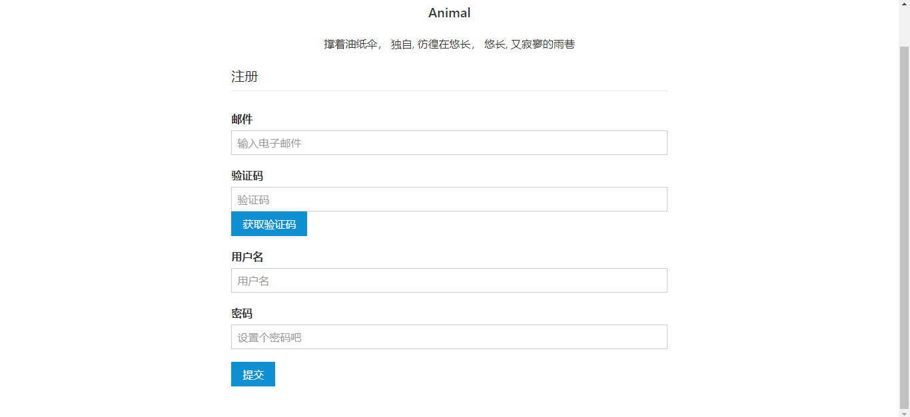

# 博文论坛
一个博客论坛WEB项目，预想类是与 ITeye，每个人都可发表博文，每个人都可以评论, 是一个干净整洁的地方。

互相交流学习生活感悟，共同奋进努力。

## 技术栈

本项目为Spring 全家桶，代表着态度的转变，由以前厌恶 Spring 框架转变为接受并承认 Spring 的优点的转变。

* SpringBoot 脚手架。
* Spring IoC 容器
* SpringMVC 作为MVC 中的 C 控制器
* SpringDataJpa  使用Jpa规范 ORM 开发。
* SpringDataRedis 热点数据缓存。

使用 SpringJpa 不用建表，Hibernate 自动建表，直接声明接口就可以基本的CURD实体。不得不佩服Spring的技术功底。

## 项目模块

本项目有用户模块，首页模块，后台管理模块，标签模块，评论模块，博文上传模块。

### 用户模块

用户模块是基础模块。其他模块都依赖用户模块。用户模块的功能主要有：登陆，注册，修改用户资料。

用户实体：

```
@Entity
public class User {
    @Id
    @GeneratedValue
    private Long id; // 用户 id
//    private byte[] headPortrait;
    private String headPortraitPath; // 头像文件路径
    private String name; // 真实姓名
    @Column(nullable = false)
    private String nickName; // 昵称
    private String email; // 邮箱
    private String phone; // 手机号
    private String sex; // 性别
    private LocalDate birthDay; // 生日
    @Column(nullable = false)
    private String password; // 密码
    // 账号激活
    private boolean verify;
    private Set<Tag> tags; // 用户感兴趣的标签集合
```

注册:



登陆：


个人信息：


### 主页模块

主页是访问量比较大的模块，所以应该使用缓存来备份主页信息。


主页信息有本用户基本信息和网站公告。

和每个人发出的博文，可以使用 Redis 来构建一个主页缓存（参考《Redis 实战》第一章）。

### 后台管理模块


